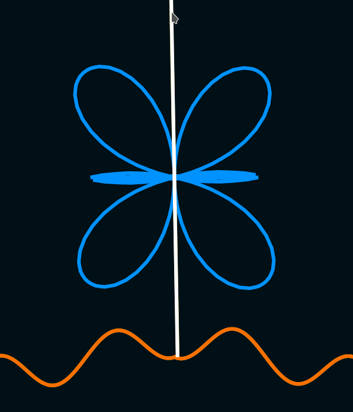

Some audio experiment I wanted to try. Js was the easiest way

It consists on the manipulation of a tiny sound grain by means of angle.
The lines indicate the angles at which the wave is "viewed"; meaning that one component of that wave gets removed from a polar perspective.

Each sample is assumed as a polar coordinate (where time is theta), projected to a cartesian space, the x component is set to 0, and then is projected back into the polar space.

# play
**don't use headphones, or detach them from your ears while trying this. extremely loud sounds may come out suddenly**

open /dist/index.html

try what happens when dragging each line

# read

https://autotel.co/blog/polar-sound-transformations/

# imagine *   ✫ ˚ .. . 

I need to create an interpolator so that sound won't glitch when changing things. Maybe I don't do it. This is a proof of concept that I might try implement in a hardware synth some other day, when I figure out my microcontroller audio buffering problems.

